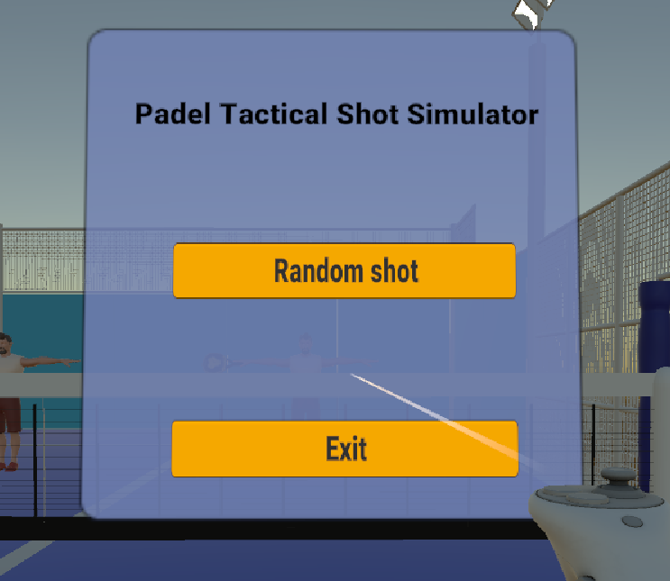
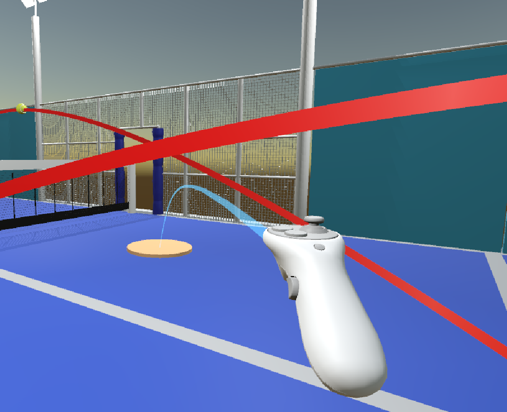
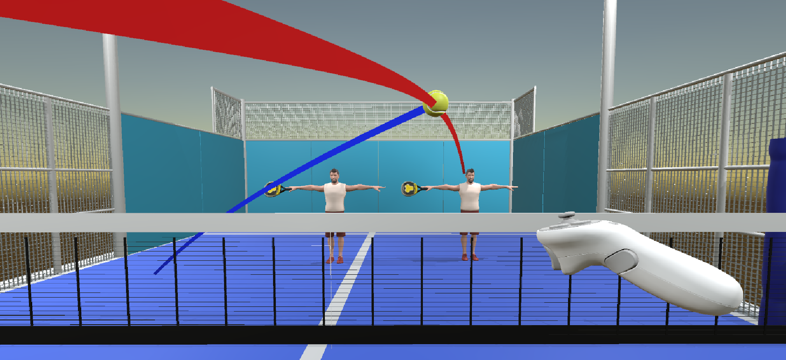
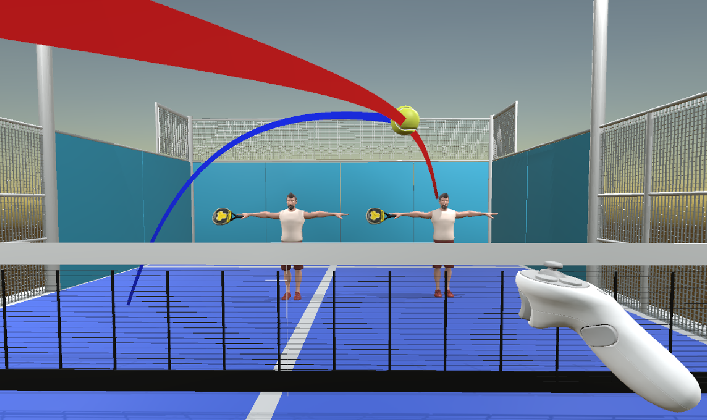
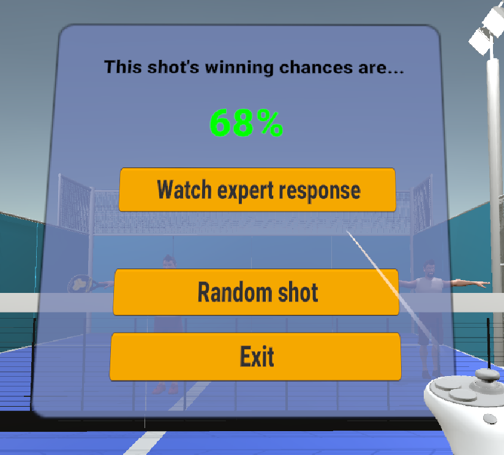

# VR Padel Tactics

VR Padel Tactics is the result of my end of degree thesis.

It's a padel VR simulator that recreates parts of the Men's final round of **World Padel Tour's Estrella Damm Open 2020**.
Using metadata extracted from the video recording of the match, I'm able to estimate ball paths and begin a random simulation.

The user is able to interact with the ball, but to make sure technique doesn't get in the way, they can choose the target and height of the path instead of using a racket.

The system is capable of evaluating the performance of the shot executed by the user, and provide insight from a tactical point of view. Specifically, the shot is rated by a logistic regression, and the user can choose to watch the expert shot.

I've implemented the project in `Unity`, using `Open XR` to assist with the user's interaction through Meta Quest 2.

## Usage

1. Follow the Installation and Setup instructions below.
2. Connect your Meta Quest 2 or Meta Quest 3, or enable the XR Simulator GameObject.
3. You can either choose to build and executable or use Unity's Editor to run the application.
4. Immerse yourself into the experience.
5. Interact with the user interface with your right controller, pressing its trigger to select menu options.
6. Start playing a random shot. Choose the location where you want to answer, and select target and height.
7. Receive an score and optionally wathc the expert response to this game situation.
8. Start again :)

## Demonstration images

Here you can see how the previously described process looks like:

1. Starting menu interaction

2. Response location choice

3. Target location choice

4. Maximum height choice

5. Response feedback

## Installation and Setup

To install and setup this project:

1. Clone the repository: `git clone git@github.com:mvalls2/VRPadelTactics.git`
2. Install the latest Unity Hub version.
3. Install the required version of the Unity Editor, Unity will take care of any other dependency.
4. Run it for the first time from Unity's Editor itself to create the path database required.

## Dependencies

- Unity `2022.3.22f1`
- XR Core Utilities `2.3.0`
- XR Interaction Toolkit `3.0.3`
- XR Legacy Input Helpers `2.1.10`
- XR Plugin Management `4.4.1`

## Implementation details

Please see my end of degree thesis for further documentation and implementation details.
